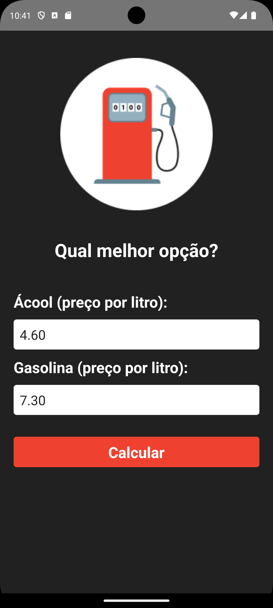

# App Combustível 

Aplicação em React Native que ajuda a determinar se é mais econômico abastecer com álcool ou gasolina, a partir de preços fornecidos pelo usuário.

## Descrição

O aplicativo permite que o usuário insira os preços por litro de álcool e gasolina, e calcula qual é a melhor opção. A lógica de cálculo segue a regra comum: se o preço do álcool dividido pelo preço da gasolina for menor que 0.7, então é mais vantajoso usar álcool, caso contrário, gasolina.

## Instalação

1. **Clone o repositório:**
   ```bash
   git clone https://github.com/leandrovelosos/AppCombustivel.git 
2. **Instale as dependências:**
   ```bash
   npm install
3. **Execute o aplicativo:**
    ```bash
    npx react-native run-android
## Uso

1. Insira o preço por litro de álcool e gasolina nos campos apropriados.
2. Pressione o botão "Calcular".
3. Um modal será exibida indicando qual combustível é mais vantajoso com base nos preços inseridos.
4. Para realizar um novo cálculo, pressione o botão "Calcular novamente" na modal.

## Tela do app


